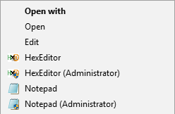

# OpenWithHexeditorNotepad
Adds the following options to the context menu:
* HexEditor
* Notepad

And the following options to the extended context menu:
* HexEditor (Administrator)
* Notepad (Administrator)

## Screenshot


## Prerequisites
* Install HxD [1] into ```%ProgramFiles%\HxD```
* Optionally install Notepad2-Mod [2] to have a proper Notepad application


[1] https://mh-nexus.de/en/hxd/  
[2] https://xhmikosr.github.io/notepad2-mod/
