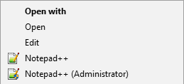
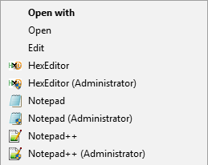

# OpenWithNotepad++
If you like me prefer to keep your context menu clean from DLL extensions, and use the native Windows context menu functionality, you can use this solution. In addition, this extension adds the Notepad++ (Administrator) option.

1. Unregister the Notepad++ extension using ``regsvr32 /u "%ProgramFiles%\Notepad++\NppShell_06.dll"``
2. Add Notepad++ to the context menu

## Screenshots
**Notepad++ in extended context menu**

**Notepad++ in extended context menu together with Notepad and HexEditor**

## Prerequisite
* Install Notepad++ [1]

[1] https://notepad-plus-plus.org/